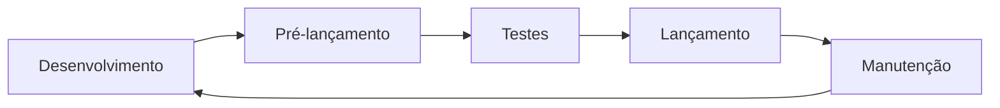

# 🏷️ Sistema de Versionamento Semântico

> **Guia completo do sistema de versionamento implementado no projetoAgenteIA**

---

## 📋 Visão Geral

O projeto utiliza **Semantic Versioning (SemVer)** para controle de versões, seguindo o padrão `MAJOR.MINOR.PATCH`.

### 🎯 Objetivos

- **Controle preciso** de versões do software
- **Comunicação clara** sobre mudanças
- **Compatibilidade** entre versões
- **Automação** do processo de lançamento

---

## 🏗️ Estrutura do Sistema

### 📁 Arquivos Envolvidos

| Arquivo | Função | Descrição |
|---------|---------|-----------|
| `VERSION` | Controle central | Armazena versão atual (ex: `1.0.1`) |
| `version.sh` | Automação | Script completo para gerenciamento de versões |
| `CHANGELOG.md` | Histórico | Registro de todas as mudanças significativas |
| `CMakeLists.txt` | Build | Integra versão no processo de compilação |
| `include/build_info.hpp` | Runtime | Informações de build disponíveis em tempo de execução |
| `scripts.sh` | Interface | Comandos de versionamento no script unificado |

---

## 📖 Formato SemVer

### 🏷️ Estrutura: `MAJOR.MINOR.PATCH[-PRERELEASE]`

#### **MAJOR** (X.0.0)
- Mudanças **incompatíveis** com versões anteriores
- Requer migração ou atualização manual
- Ex: `1.0.0 → 2.0.0`

#### **MINOR** (X.Y.0)
- Novas funcionalidades **compatíveis** com versões anteriores
- Adições que não quebram API existente
- Ex: `1.0.0 → 1.1.0`

#### **PATCH** (X.Y.Z)
- Correções de bugs **compatíveis** com versões anteriores
- Pequenas melhorias e correções
- Ex: `1.0.0 → 1.0.1`

#### **PRERELEASE** (-alpha.1, -beta.1, -rc.1)
- Versões de **pré-lançamento**
- Instáveis, para testes e feedback
- Ex: `1.1.0-alpha.1`, `1.1.0-beta.1`, `1.1.0-rc.1`

---

## 🛠️ Ferramentas e Comandos

### 📜 Script Principal: `version.sh`

#### 🚀 Comandos Básicos

```bash
./version.sh current          # Mostrar versão atual
./version.sh patch           # 1.0.0 → 1.0.1
./version.sh minor           # 1.0.1 → 1.1.0
./version.sh major           # 1.1.0 → 2.0.0
```

#### 🧪 Pré-lançamentos

```bash
./version.sh pre alpha      # 1.1.0 → 1.1.0-alpha.1
./version.sh pre beta       # 1.1.0-alpha.1 → 1.1.0-beta.1
./version.sh pre rc         # 1.1.0-beta.1 → 1.1.0-rc.1
```

#### 🎯 Lançamentos

```bash
./version.sh release        # 1.1.0-rc.1 → 1.1.0
./version.sh tag 2.0.0    # Criar tag específica
```

#### 🛠️ Utilitários

```bash
./version.sh init           # Inicializar sistema
./version.sh changelog      # Gerar/abrir CHANGELOG.md
./version.sh help           # Ajuda completa
```

### 🎨 Script Unificado: `scripts.sh`

```bash
./scripts.sh version current   # Versão atual
./scripts.sh version patch    # Incrementar patch
./scripts.sh version minor    # Incrementar minor
./scripts.sh version major    # Incrementar major
./scripts.sh version pre     # Criar pré-lançamento
./scripts.sh version release  # Criar lançamento
./scripts.sh version tag     # Criar tag
./scripts.sh version changelog # Gerar changelog
```

---

## 🔄 Fluxo de Trabalho

### 📅 Ciclo de Desenvolvimento



#### 1. 🚀 Desenvolvimento
- Trabalho em branch `main` ou `develop`
- Commits frequentes com mensagens claras
- Testes contínuos

#### 2. 🧪 Pré-lançamento
- Criar versão `alpha` para testes internos
- Criar versão `beta` para testes com usuários
- Criar versão `rc` para lançamento iminente

#### 3. 🧪 Testes
- Validação completa da funcionalidade
- Testes de regressão
- Feedback e correções

#### 4. 🎯 Lançamento
- Criar versão final (sem sufixo)
- Gerar tag Git
- Atualizar CHANGELOG.md

#### 5. 🔧 Manutenção
- Correções de bugs (patch)
- Pequenas melhorias
- Atualizações de segurança

---

## 📝 CHANGELOG.md

### 📋 Estrutura

```markdown
# Changelog

## [Unreleased]

## [1.0.0] - 2026-04-06

### Adicionado
- Funcionalidade X
- Melhoria Y

### Alterado
- Comportamento Z

### Removido
- Componente W

### Corrigido
- Bug #123

### Segurança
- Correção de vulnerabilidade X
```

### 📝 Regras

1. **Mantenha o formato** padrão
2. **Use datas** no formato `YYYY-MM-DD`
3. **Seja descritivo** nas mudanças
4. **Referencie issues** quando aplicável
5. **Mantenha ordem** cronológica

---

## 🏗️ Integração com Build

### 📦 CMake Integration

O arquivo `VERSION` é lido pelo `CMakeLists.txt`:

```cmake
if(EXISTS "${CMAKE_SOURCE_DIR}/VERSION")
    file(READ "${CMAKE_SOURCE_DIR}/VERSION" PROJECT_VERSION)
    message(STATUS "Versão do projeto: ${PROJECT_VERSION}")
else()
    set(PROJECT_VERSION "1.0.0")
    message(STATUS "Arquivo VERSION não encontrado, usando versão padrão: ${PROJECT_VERSION}")
endif()

project(projetoAgenteIA VERSION ${PROJECT_VERSION} LANGUAGES CXX)
```

### 🔍 Build Info em Runtime

O script gera `include/build_info.hpp` com informações disponíveis em tempo de execução:

```cpp
namespace projetoAgenteIA {
    constexpr const char* VERSION = "1.0.1";
    constexpr const char* BUILD_DATE = "2026-04-06 23:38:50";
    constexpr const char* GIT_HASH = "4f758ca";
    constexpr const char* GIT_BRANCH = "version_3";
}
```

---

## 🏷️ Git Tags

### 📋 Padrão de Nomenclatura

- **Tags de versão**: `vMAJOR.MINOR.PATCH`
- **Pré-lançamentos**: `vMAJOR.MINOR.PATCH-alpha.N`
- **Exemplos**: `v1.0.0`, `v1.1.0-beta.1`

### 🔄 Criação Automática

```bash
# O script version.sh cria tags automaticamente
./version.sh patch    # Cria tag v1.0.1
./version.sh release   # Cria tag v1.1.0
```

---

## 📊 Exemplos Práticos

### 🚀 Novo Projeto

```bash
# Inicializar versionamento
./version.sh init

# Primeiro desenvolvimento
# ... commits ...

# Primeiro lançamento
./version.sh release
```

### 🛠️ Desenvolvimento Contínuo

```bash
# Nova feature
git checkout -b feature/nova-funcionalidade
# ... desenvolvimento ...
git checkout main
git merge feature/nova-funcionalidade

# Pré-lançamento
./version.sh pre alpha
# ... testes ...

# Lançamento
./version.sh release
```

### 🐛 Correção de Bug

```bash
# Correção rápida
git commit -m "Fix: correção do bug X"

# Patch release
./version.sh patch
```

---

## 🎯 Melhores Práticas

### ✅ Do's

1. **Commits descritivos**:
   - `feat: adicionar nova funcionalidade`
   - `fix: corrigir bug específico`
   - `docs: atualizar documentação`
   - `refactor: refatorar código`

2. **Versionamento consistente**:
   - Use `patch` para correções
   - Use `minor` para novas features
   - Use `major` para breaking changes

3. **Testes completos**:
   - Valide pré-lançamentos
   - Teste versões finais
   - Mantenha compatibilidade backward

4. **Documentação atualizada**:
   - Mantenha CHANGELOG.md atualizado
   - Documente mudanças breaking
   - Adicione exemplos quando necessário

### ❌ Don'ts

1. **Não pule versões**:
   - Cada mudança merece sua versão
   - Mantenha histórico completo

2. **Não misture tipos**:
   - Não use `minor` para breaking changes
   - Não use `major` para features compatíveis

3. **Não esqueça o changelog**:
   - Documente todas as mudanças significativas
   - Mantenha formato consistente

---

## 🔗 Recursos Adicionais

### 📖 Documentação Oficial

- [Semantic Versioning 2.0.0](https://semver.org/)
- [Keep a Changelog](https://keepachangelog.com/pt-BR/1.0.0/)
- [Conventional Commits](https://www.conventionalcommits.org/)

### 🛠️ Ferramentas Relacionadas

- [Git Versioning](https://git-scm.com/book/en/v2/Git-Tools-Tagging.html)
- [CMake Versioning](https://cmake.org/cmake/help/latest/command/project.html)
- [Release Automation](https://github.com/semantic-release/semantic-release)

---

## 🚀 Integração Contínua

### 🔄 CI/CD Pipeline

O sistema pode ser integrado com CI/CD para automação:

```yaml
# .github/workflows/release.yml
name: Release
on:
  push:
    tags:
      - 'v*'
jobs:
  release:
    runs-on: ubuntu-latest
    steps:
      - uses: actions/checkout@v2
      - name: Build and Test
        run: |
          cmake --build build
          ctest --test-dir build
      - name: Create Release
        uses: actions/create-release@v1
        with:
          tag_name: ${{ github.ref }}
          release_name: Release ${{ github.ref }}
```

---

## 📝 Notas Finais

- Este sistema foi projetado para **escalabilidade**
- Pode ser adaptado conforme necessidades do projeto
- Mantenha **consistência** no uso
- Documente **decisões** importantes

---

**Versão deste documento**: 1.0  
**Última atualização**: 2026-04-06  
**Responsável**: projetoAgenteIA Team

---

*🏷️ Versionamento Feliz! 🚀*
